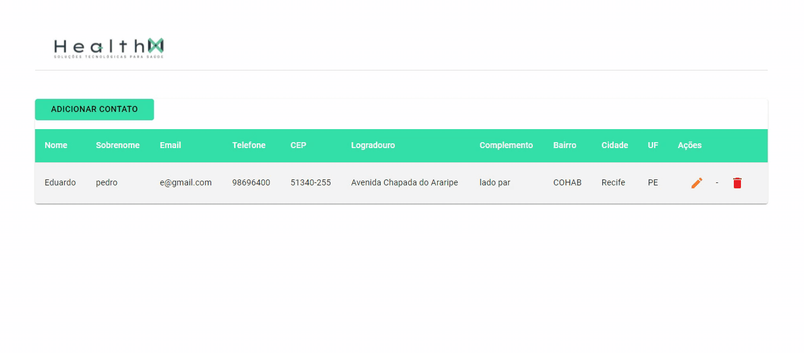

<h2 align="center">
  Desafio React - Front-end 
</h2>
<br>
<h1 align="center">
    
</h1>

<h3 align="center">
    <a href="https://desafio-react-front-end.vercel.app/">🔗 Acessar a demonstração</a>
<h3 >

# Indice

- [Sobre](#-sobre)
- [Tecnologias Utilizadas](#-tecnologias-utilizadas)
- [Como baixar o projeto](#-como-baixar-o-projeto)
- [Deploy](#-deploy)

<br>

## 🔖&nbsp; Sobre

Desenvolver um CRUD de contatos utilizando o React. A listagem, adição, edição e
exclusão dos contatos

---

## 🚀 Tecnologias utilizadas

Reactjs :

- Context Api,
- Fetch,
- material-ui,
- react-toastify

---

<br>

## 🗂 Como baixar o projeto

```bash

    # Clonar o repositório
    $ git clone https://github.com/edpedro/Desafio-React-Front-end.git

    # Entrar no diretório
    $ cd web

    # Instalar as dependências
    $ yarn install

    # Iniciar o projeto
    $ yarn start

```

## 🚧 Deploy

vercel

- Reactjs

---

<br>

---

Desenvolvido 💜 por Eduardo Pedro, Edp2013.ep@gmail.com
